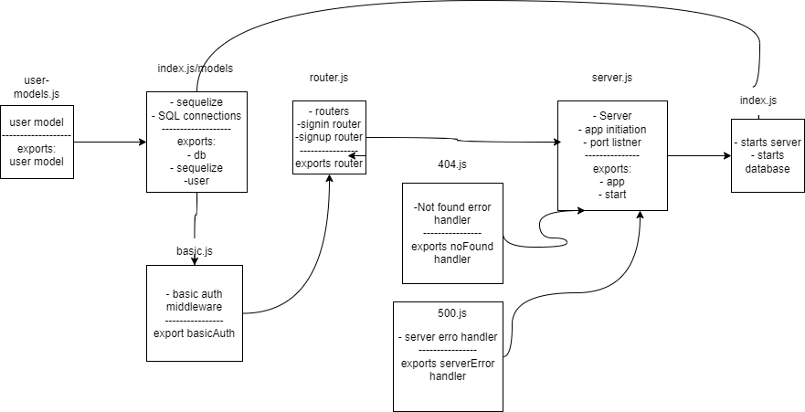

# basic-auth
## UML Drawing

## [pull-request](https://github.com/Mhsalameh/basic-auth/pull/2)
## [heroku app](https://mohammad-basic-auth.herokuapp.com/)
## [actions](https://github.com/Mhsalameh/basic-auth/actions)
